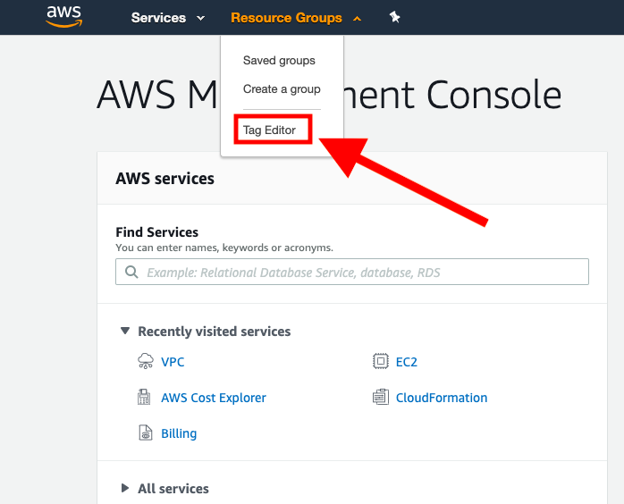
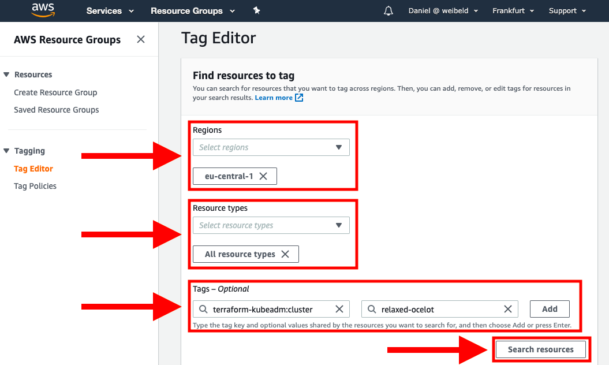

# AWS kubeadm module

Terraform module for creating a kubeadm cluster on AWS.

## Contents

- [**Description**](#description)
- [**Intended usage**](#intended-usage)
- [**Quick start**](#quick-start)
- [**Prerequisites**](#prerequisites)
- [**AWS resources**](#aws-resources)
- [**Network submodule**](#network-submodule)

## Description

This module allows to create AWS infrastructure and bootstrap a Kubernetes cluster on it with a single command.

Running the module results in a freshly bootstrapped Kubernetes cluster — like what you get after manually bootstrapping a cluster with `kubeadm init` and `kubeadm join`.

The module also creates a kubeconfig file on your local machine so that you can access the cluster right away.

The number and types of nodes, the Pod network CIDR block, and many other parameters are configurable.

Notes:

- The module does not install any CNI plugin in the cluster, which reflects the behaviour of kubeadm
- For now, the created clusters are limited to a single master node

## Intended usage

The module is intended to be used for experiments. It automates the process of bootstrapping a cluster, which allows you to create a series of clusters quickly and then run experiments on them.

The module does on purpose not produce production-ready cluster, for example, by installing a CNI plugin, because this might interfere with experiments that you want to run on the bootstrapped clusters.

In other words, since the module does not install a CNI plugin by default, you can use this module to test arbitrary configurations of CNI plugins on a freshly bootstrapped cluster.

## Quick start

> This guide assumes that you have [installed Terraform](https://www.terraform.io/downloads.html) and [configured AWS credentials](https://docs.aws.amazon.com/cli/latest/userguide/cli-configure-quickstart.html) on your machine (if you're already using the [AWS CLI](https://aws.amazon.com/cli/), then the latter point is automatically fulfilled).

Create a new directory for your Terraform configuration:

```bash
mkdir terraform-kubeadm
cd $_
```

Save the following in a file named `main.tf`:

```hcl
provider "aws" {
  region = "eu-central-1"
}

module "cluster" {
  source           = "weibeld/kubeadm/aws"
  version          = "~> 0.2"
}
```

> In the above example, `eu-central-1` is the [AWS region](https://docs.aws.amazon.com/AWSEC2/latest/UserGuide/using-regions-availability-zones.html) in which the cluster will be created. You can replace this with your desired AWS region.

Run [`terraform init`](https://www.terraform.io/docs/commands/init.html) to download the `weibeld/kubeadm/aws` module:

```bash
terraform init
```

Run [`terraform apply`](https://www.terraform.io/docs/commands/apply.html) to create the cluster:

```bash
terraform apply
```

When the above command completes, you should have a kubeconfig file with a random name (such as `relaxed-ocelot.conf`) in your current working directory. You can use this kubeconfig file to access your newly created Kubernetes cluster as follows:

```bash
kubectl --kubeconfig relaxed-ocelot.conf get nodes
```

> You can also set the [`KUBECONFIG`](https://kubernetes.io/docs/concepts/configuration/organize-cluster-access-kubeconfig/#the-kubeconfig-environment-variable) environment variable in your shell to avoid using the `--kubeconfig` flag.

**Note that the nodes of your cluster currently are `NotReady`.**

This is because there's no [Container Networking Interface (CNI) plugin](https://github.com/containernetworking/cni) installed in your cluster yet. You have to carry out this step manually before you can use your cluster, thus giving you the flexibiltiy to freely choose the CNI plugin you want to use.

As an example, here's how you can install the [Calico CNI plugin](https://www.projectcalico.org/):

```bash
kubectl --kubeconfig relaxed-ocelot.conf apply \
  -f https://docs.projectcalico.org/manifests/calico.yaml
```

After a minute or two, your nodes should be `Ready`:

```bash
kubectl --kubeconfig relaxed-ocelot.conf get nodes
```

Your cluster is now complete and you can start using it!

To destroy the cluster and all the underlying AWS resources, you can use the [`terraform destroy`](https://www.terraform.io/docs/commands/destroy.html) command:

```bash
terraform destroy
```

> _Note that the `terraform destroy` command doesn't delete the kubeconfig file in your current working directory, so you have to do this manually._

## AWS resources

### Listing resources belonging to the cluster

The module creates a couple of AWS resources in your account. With the default parameters (1 master nodes and 2 worker nodes), these are:

| Explicitly created        | Implicitly created (default sub-resources)                          |
|---------------------------|---------------------------------------------------------------------|
| 3 [EC2 Instances][i]      | 3 [Volumes][vol], 3 [Network Interfaces][eni]                       |
| 4 [Security Groups][sg]   |                                                                     |
| 1 [Elastic IP][eip]       |                                                                     |
| 1 [Key Pair][key]         |                                                                     |

You can list all the AWS resources belonging to your cluster in the [AWS Tag Editor](https://console.aws.amazon.com/resource-groups/tag-editor). To do so, log in to your AWS Console and click on *Resource Groups > Tag Editor*:



In the Tag Editor, select the AWS region in which you created the cluster, select _All resource types_, and fill in the _**tag key**_ field with **`terraform-kubeadm:cluster`** and the _**tag value**_ field with with the name of your cluster (e.g. **`relaxed-ocelot`**):



After hitting _Search resources_, you can see all the AWS resources belonging to your cluster.

> _Note that [Key Pairs][key] are not listed in the Tag Editor._

### SSH access to EC2 instances

The module also sets up SSH access to the nodes of the cluster. By default, it uses the OpenSSH default key pair consisting of `~/.ssh/id_rsa` (private key) and `~/.ssh/id_rsa.pub` (public key) on your local machine for this. Thus, you can connect to the nodes of the cluster as follows:

```bash
ssh -i ~/.ssh/id_rsa ubuntu@<PUBLIC-IP>
```

The public IP addresses of all the nodes are specified in the output of the module, which you can display with `terraform output`.

For details about the created AWS resources, see [AWS resources](#aws-resources) below. For more advanced usage examples, see the [examples](https://github.com/weibeld/terraform-aws-kubeadm/tree/master/examples).


All of the explicitly created AWS resources get a tag so that you can easily identify them. This tag has the following form:

```
terraform-kubeadm:cluster=<cluster-name>
```

Where `<cluster-name>` is the name of your created cluster (such as `relaxed-ocelot`).


Running `terraform apply` with this configuration results in the creation of a Kubernetes cluster with one master node and two worker nodes in one of the default subnets of the default VPC of the `eu-central-1` region.

The cluster is given a random name (e.g. `relaxed-ocelot`) and the module creates a kubeconfig file on your local machine that is named after the cluster it belongs to (e.g. `relaxed-ocelot.conf`). By default, this kubeconfig file is created in your current working directory.

You can use this kubeconfig file to access the cluster. For example:

```bash
kubectl --kubeconfig relaxed-ocelot.conf get nodes
```

> Note that if you execute the above command, you will see that all nodes are `NotReady`. This is the expected behaviour because the cluster does not yet have a CNI plugin installed.

You may also set the [`KUBECONFIG`](https://kubernetes.io/docs/tasks/access-application-cluster/configure-access-multiple-clusters/#set-the-kubeconfig-environment-variable) environment variable so that you don't need to set the `--kubeconfig` flag for every kubectl command:

```bash
export KUBECONFIG=$(pwd)/relaxed-ocelot.conf
```

> Note that when you delete the cluster with `terraform destroy`, the kubeconfig file is currently not automatically deleted, thus you have to clean it up yourself if you don't want to have it sticking around.

The module also sets up SSH access to the nodes of the cluster. By default, it uses the OpenSSH default key pair consisting of `~/.ssh/id_rsa` (private key) and `~/.ssh/id_rsa.pub` (public key) on your local machine for this. Thus, you can connect to the nodes of the cluster as follows:

```bash
ssh -i ~/.ssh/id_rsa ubuntu@<PUBLIC-IP>
```

The public IP addresses of all the nodes are specified in the output of the module, which you can display with `terraform output`.

For details about the created AWS resources, see [AWS resources](#aws-resources) below. For more advanced usage examples, see the [examples](https://github.com/weibeld/terraform-aws-kubeadm/tree/master/examples).

## Prerequisites

The module depends on the following prerequisites:

### 1. Install Terraform

[Installing Terraform](https://www.terraform.io/downloads.html) is done by simply downloading the Terraform binary for your target platform from the Terraform website and moving it to any directory in your `PATH`.

On macOS, you can alternatively install Terraform with:

```bash
brew install terraform
```

### 2. Configure AWS credentials

Terraform needs to have access to the **AWS Access Key ID** and **AWS Secret Access Key** of your AWS account in order to create AWS resources.

You can achieve this in one of the two following ways:

-  Create an [`~/.aws/credentials`](https://docs.aws.amazon.com/cli/latest/userguide/cli-configure-files.html#cli-configure-files-where) file. This is automatically done for you if you configure the [AWS CLI](https://aws.amazon.com/cli/):

    ```bash
    aws configure
    ```

- Set the [`AWS_ACCESS_KEY_ID` and `AWS_SECRET_ACCESS_KEY`](https://docs.aws.amazon.com/cli/latest/userguide/cli-configure-envvars.html) environment variables to your Access Key ID and Secret Access Key:

    ```bash
    export AWS_ACCESS_KEY_ID=<AccessKeyID>
    export AWS_SECRET_ACCESS_KEY=<SecretAccessKey>
    ```

### 3. Set up OpenSSH

The module depends on the `ssh` and `scp` tools being installed on your local machine. These tools are installed by default on most systems as part of the [OpenSSH](https://www.openssh.com/) package. In the unlikely case that OpenSSH isn't installed on your system, you can install it with:

```bash
# Linux
sudo apt-get install openssh-client
# macOS
brew install openssh
```

Furthermore, the module by default uses the default OpenSSH key pair consisting of `~/.ssh/id_rsa` (private key) and `~/.ssh/id_rsa.pub` (public key) for setting up SSH access to the nodes of the cluster.

If you currently don't have this key pair on your system, you can generate it by running:

```bash
ssh-keygen
```

Note that `~/.ssh/id_rsa` and `~/.ssh/id_rsa.pub` are just default values and you can specify a different key pair to the module (with the `private_key_file` and `public_key_file` variables).

For example, you can generate a dedicated key pair for your cluster with:

```bash
ssh-keygen -f my-key
```

Which creates two files named `my-key` (private key) and `my-key.pub` (public key), which you can then specify to the corresponding input variables of the module.

## AWS resources

With the default settings (1 master node and 2 worker nodes), the module creates the following AWS resources:

| Explicitly created        | Implicitly created (default sub-resources)                          |
|---------------------------|---------------------------------------------------------------------|
| 4 [Security Groups][sg]   |                                                                     |
| 1 [Key Pair][key]         |                                                                     |
| 1 [Elastic IP][eip]       |                                                                     |
| 3 [EC2 Instances][i]      | 3 [Volumes][vol], 3 [Network Interfaces][eni]                       |

**Total: 15 resources**

[sg]: https://docs.aws.amazon.com/vpc/latest/userguide/VPC_SecurityGroups.html
[eip]: https://docs.aws.amazon.com/AWSEC2/latest/UserGuide/elastic-ip-addresses-eip.html
[i]: https://docs.aws.amazon.com/AWSEC2/latest/UserGuide/concepts.html
[vol]: https://docs.aws.amazon.com/AWSEC2/latest/UserGuide/AmazonEBS.html
[eni]: https://docs.aws.amazon.com/AWSEC2/latest/UserGuide/using-eni.html
[key]: https://docs.aws.amazon.com/AWSEC2/latest/UserGuide/ec2-key-pairs.html

Note that each node results in the creation of 3 AWS resources: 1 EC2 instance, 1 Volume, and 1 Network Interface. Consequently, you can add or subtract 3 from the total number of created AWS resources for each added or removed worker node. For example:

- 1 worker node: total 12 AWS resources
- 2 worker nodes: total 15 AWS resources
- 3 worker nodes: total 18 AWS resources

You can list all AWS resources in a given region with the [Tag Editor](https://console.aws.amazon.com/resource-groups/tag-editor) in the AWS Console.

> Note that [Key Pairs][key] are not listed in the Tag Editor.

### Tags

The module assigns a tag with a key of `kubeadm:cluster` and a value corresponding to the cluster name to all explicitly created resources. For example, if the cluster name is `relaxed-ocelot`, all of the above explicitly created resources will have the following tag:

```
kubeadm:cluster=relaxed-ocelot
```

This allows you to easily identify the resources that belong to a given cluster.

> Note that the implicitly created sub-resources (such as the Volumes and Network Interfaces of the EC2 Instances) won't have the `kubeadm:cluster` tag assigned.

Additionally, the EC2 instances will get a tag with a key of `kubeadm:node` and a value corresponding to the Kubernetes node name. For the master node, this is:

```
kubeadm:node=master
```

And for the worker nodes:

```
kubeadm:node=worker-X
```

Where `X` is an index starting at 0.

## Network submodule

By default, the kubeadm module creates the cluster in the [default VPC](https://docs.aws.amazon.com/vpc/latest/userguide/default-vpc.html) of the specified AWS region.

The [network submodule](https://github.com/weibeld/terraform-aws-kubeadm/tree/master/modules/network) allows you to create a dedicated VPC for your cluster.

See the [_cluster in dedicated VPC_](https://github.com/weibeld/terraform-aws-kubeadm/tree/master/examples/ex3-cluster-in-dedicated-vpc) example for how to use the network submodule together with the kubeadm module.
